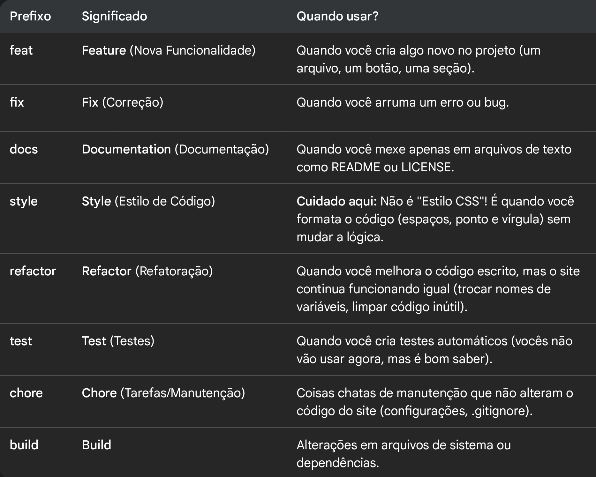

# Guia de Contribuição

## Como criar commits
Para manter o histórico limpo e organizado, siga a tabela de prefixos abaixo:

| Prefixo | Significado | Quando usar? |
| :--- | :--- | :--- |
| `feat` | Feature (Nova Funcionalidade) | Quando você cria algo novo no projeto (um arquivo, um botão, uma seção). |
| `fix` | Fix (Correção) | Quando você arruma um erro ou bug. |
| `docs` | Documentation (Documentação) | Quando você mexe apenas em arquivos de texto como README ou LICENSE. |
| `style` | Style (Estilo de Código) | **Cuidado:** Não é "Estilo CSS"! É quando você formata o código (espaços, ponto e vírgula) sem mudar a lógica. |
| `refactor` | Refactor (Refatoração) | Quando você melhora o código escrito, mas o site continua funcionando igual (trocar nomes de variáveis, limpar código inútil). |
| `test` | Test (Testes) | Quando você cria testes automáticos. |
| `chore` | Chore (Tarefas/Manutenção) | Coisas chatas de manutenção que não alteram o código do site (configurações, `.gitignore`). |
| `build` | Build | Alterações em arquivos de sistema ou dependências. |

### Ou siga a imagem

